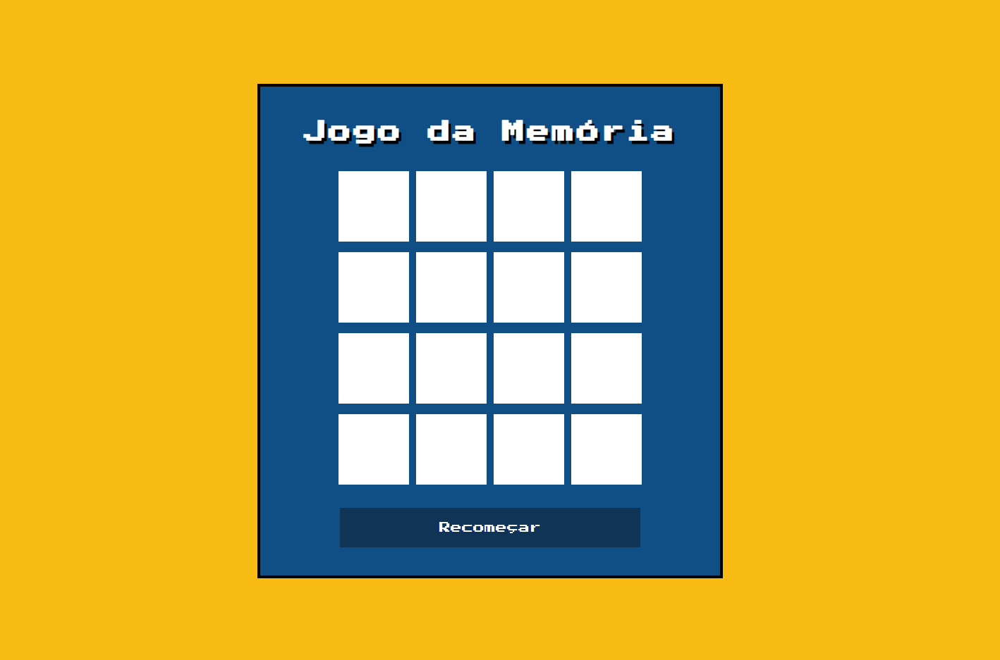
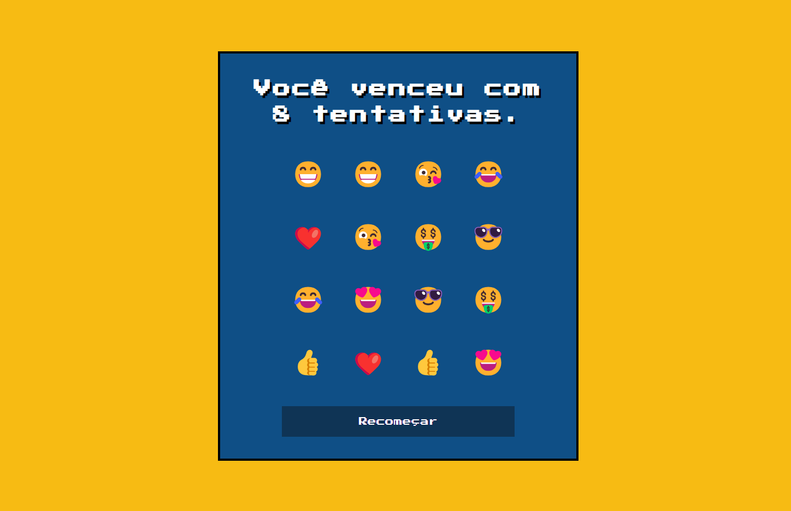

# Jogo da Memória

Bem-vindo ao meu Jogo da Memória (com Emojis 😁😎😝) 
Este é um pequeno projeto de jogo da memória desenvolvido com JavaScript, HTML e CSS.

## Como Jogar

1. Acesse o jogo online pelo link: https://jsilva-js.github.io/jogo-da-memoria/
2. Você verá uma grade de cartas viradas para baixo. Clique em duas cartas para revelar seus emojis.
3. Tente encontrar pares correspondentes de emojis clicando em duas cartas de cada vez.
4. O jogo continua até que todas as cartas sejam combinadas.
5. Você pode reiniciar o jogo a qualquer momento clicando no botão "Recomeçar".

## Instruções de Desenvolvimento

Se você deseja contribuir para o desenvolvimento deste jogo, siga estas instruções:

1. Clone o repositório: `git clone https://github.com/jsilva-js/jogo-da-memoria.git`
2. Abra o diretório do projeto: `cd jogo-da-memoria`
3. Faça suas modificações no código-fonte.
4. Teste o jogo localmente para garantir que suas alterações não quebraram nada.
5. Envie um pull request com suas alterações.

## Capturas de Tela

## Autor

Desenvolvido por [Jefferson Silva](https://github.com/jsilva-js).
