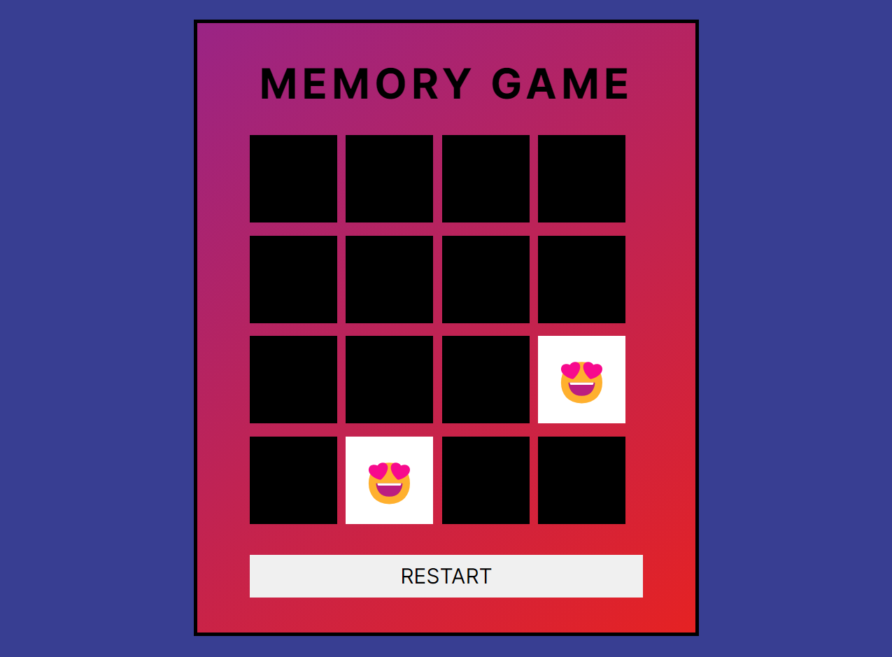

# Jogo da Memória - Emojis

Bem-vindo ao Jogo da Memória - Edição Emoji! Um desafio simples e divertido criado com HTML, CSS e JavaScript. Teste sua memória combinando pares de emojis escondidos atrás de cartões. Vire as cartas e descubra todos os pares correspondentes para se consagrar vitorioso!

## Como Jogar

### Objetivo:
Encontre todos os pares de emojis, virando as cartas.

### Jogabilidade:
1. Clique em uma carta para revelar o emoji.
2. Clique em outra carta para encontrar seu par correspondente.
3. Em caso de correspondência, as cartas permanecerão viradas para cima.
4. Se os emojis não combinarem, as cartas virarão novamente.
5. Continue esse processo até descobrir todos os pares.

### Vencendo o Jogo:
Encontre todos os pares para alcançar a vitória!

## Executando o Jogo Localmente

1. **Clone o Repositório:**
   ```bash
   git clone https://github.com/jsilva-js/jogo-memoria-emojis.git
   ```

2. **Navegue até o Diretório:**
   ```bash
   cd jogo-memoria-emojis
   ```

3. **Abra o Jogo:**
   - Abra o arquivo `index.html` em seu navegador.

